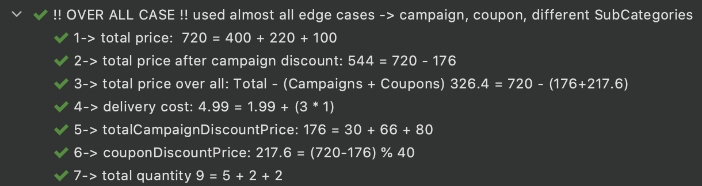
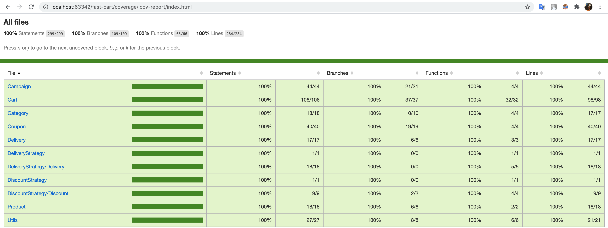

[](https://travis-ci.org/xhkocatepe/fast-cart) [](https://coveralls.io/github/xhkocatepe/fast-cart?branch=master)    
# Fast CarT -  Happy Trading! 

Fast CarT-Trade application is completely written in Node.js.

# Overview
* Get an empty cart and start shopping!
* Creating a new Cart,
* Add/Remove items with quantity to cart, 
* Apply campaigns to cart. 
* Apply a coupon to cart. 
* Calculate delivery cost which depends on delivery badge!
* PS: Do not forget 
    * Create categories which may have parents.
    * Create products which belongs to category.
    
# Installation

```
git clone https://github.com/xhkocatepe/fast-cart.git
npm install
npm test
npm run coverage
```


### Details of Business Side:
- Category
    - In system, create new Category for defining to product,
    - Category may have parent,
    - Add/remove campaigns to Category.

- Product
    - In System, create new Product for adding to cart,
    - Product consists of price and category.

- Campaign
    - In system, create new Campaign for using discount to cart,
    - Campaign consists of minimum quantity, discount type (rate, amount) and value,
    - Campaign is applicable to a product of category,
    - One product is only applicable one campaign,
    - After applied coupon, is not allowed to apply campaign.
    - User does not choice campaigns, system has choosen the best applicable campaign for product,
    - The system applies the campaign with the highest discount on the product.’
    - The type of campaign discount is determined according to the Discount Strategy.

- Coupon
    - In system, create new Coupon for using discount to cart,
    - Coupon consists of minimum price, discount type (rate, amount) and value.
    - Coupon is applicable to cart.
    - Only one coupon is applicable to cart.
    - The type of coupon discount is determined according to the Discount Strategy.

- Delivery
    - The system has a badge schema to ensure dynamically of delivery cost,
    - In Delivery Strategy system consists of Gold, Premium and Standart delivery strategy types,
    - Delivery Score is calculated by number of products and deliveries, 
    - Delivery Cost is calculated by number of products through Delivery Strategy like Gold, Premium, Standart.
    
# Sample Scenario 
A sample scenario is created for understand clearly the app.

If you desire to see test detail through app, please click to below link.

[Sample Scenario Test Detail: ./Test/Cart.spec.js ](https://github.com/xhkocatepe/fast-cart/blob/177bbac44b14fba5376a12616e0991a7d41c6e8d/Test/Cart.spec.js#L55)
- Category
    - cosmeticRootCategory
    - makeUpChildCategory -> cosmeticRootCategory
    - lipChildCategory -> makeUpChildCategory -> cosmeticRootCategory
    - bodyCareChildCategory -> cosmeticRootCategory

- Product
    - lipLinerProduct ( price: 50, category: lipChildCategory)
    - lipStickProduct (price:110. category: lipChildCategory)
    - bodyLotionProduct (price:110. category: bodyLotionProduct)


- Campaign
    - cosmeticCampaign = ( category: cosmeticRootCategory, minQuantity: 5, value: 20, type: Rate)
        - %20 discount when minimum 5 cosmeticRootCategory products
    - makeUpCampaign = (category: makeUpChildCategory, minQuantity: 3, value: 30, type: Rate) 
        - %30 discount when minimum 3 makeup products
    - bodyCareCampaign = (category: bodyCareChildCategory, minQuantity: 2, value: 75, type: Amount)
        - 75 TL discount when minimum 1 makeUpChildCategory products.

- Coupon
    - couponSmall = (minPrice: 200, value: 70, type: Amount)
        - 70 TL discount when total price greater than 200 TL on cart
    - couponMedium =  (minPrice: 300, value: 120, type: Amount)
        - 120 TL discount when total price greater than 300 TL on cart. 
    - couponLarge =  (minPrice: 500, value: 40, type: Rate)
        - %40 discount when total price greater than 500 TL on cart

#### Let’s start trading!

Cart = new Cart();

cart.addItem(lipLinerProduct, 2);

cart.addItem(lipStickProduct, 2);

cart.addItem(bodyLotionProduct, 5);

cart.applyCampaigns();

cart.applyCoupon(couponLarge);


##### Campaign Result
- Caught 3 ApplicableCampaigns! -> 
    - cosmeticCampaign (limit: 5),
    - bodyCareCampaign (limit: 2),
    - makeUpCampaign (limit: 3)
- Apply Campaign according to a Product Category!
- Item1 -> lipLinerProduct  => 50 * 2 = 100 TL
    - ✅ makeUpCampaign:      minQuantity 3 >= 2 | 100 % 30              => 30 TL
    - ⛔ cosmeticCampaign:    minQuantity 5 >= 5 | 100 % 20               => 20 TL
- Result1:  makeUpCampaign  > cosmeticCampaign ( 30 TL > 20 TL)

- Item2 -> lipStickProduct => 110 * 2 = 220 TL
    - ✅ makeUpCampaign:      minQuantity 3 >= 2 | 220 % 30             => 66 TL
    - ⛔ cosmeticCampaign:    minQuantity 5 >= 5 | 220 % 20             => 22 TL
- Result2: makeUpCampaign  > cosmeticCampaign ( 66 TL > 22 TL)

- Item3 -> bodyLotionProduct => 80 * 5 = 400 TL
    - ✅ cosmeticCampaign:    minQuantity 5 >= 5 | 400 % 20           => 80 TL
    - ⛔ bodyCareCampaign:    minQuantity 2 >= 2 | 400 of 75 TL.   => 75 TL
- Result3:  cosmeticCampaign > bodyCareCampaign ( 80 TL > 75 TL)

##### Coupon Result
- couponDiscountPrice: (720-176) % 40 = 217.6

All Price Result:

- Total Price: 400 + 220 + 100 = 720 TL
- Total Price After Campaign Discount: 720 - 176 = 544 TL
- Total Price Over All = Total - (Campaigns + Coupons)  720 - (176+217.6) = 326.4 TL
- Delivery Cost = 1.99 + (3 * 1) = 4.99 TL
- Total Campaign Discount Price = 30 + 66 + 80 = 176 TL
- Coupon Discount Price =  (720-176) % 40 = 217.6 TL



# Coverage Report Result

#### [Coveralls Test Result](https://coveralls.io/github/xhkocatepe/fast-cart) 


